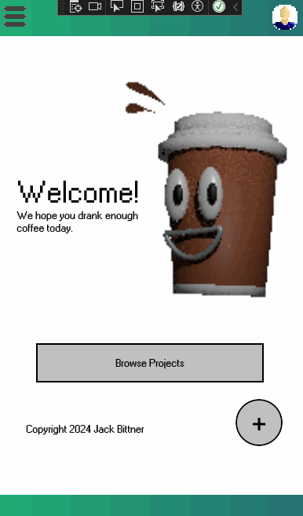

# Project Espresso
A simple project management app that is available on iOS, Apple, Android and Windows.

## Demo
The following GIF demonstrates the basic functionality of the homepage.

More demos to come as the project progresses.

## Functionality
Currently, the app uses .NET MAUI to compile down to different OS versions.  The app imitates the design styles of early Microsoft products from the 1990s and leverages a custom navigation system that is not native to .NET MAUI (for experimental purposes!!!)

## License
MIT
